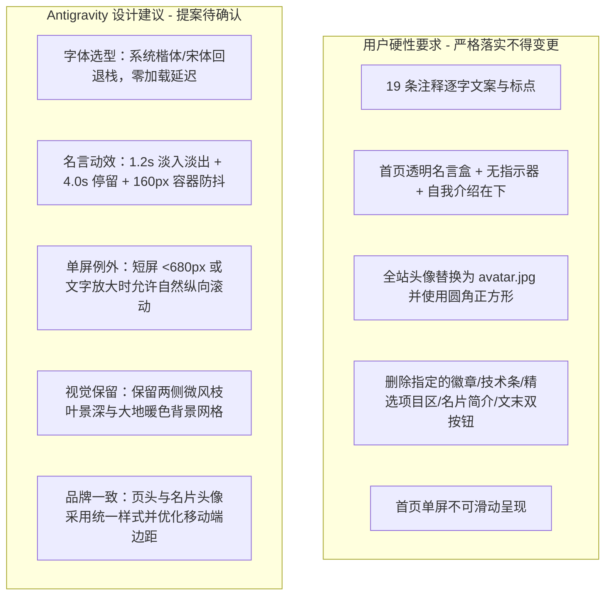

# apps/site 视觉设计规范 (DESIGN.md)

> 版本：v3.0.0  
> 状态：用户已确认，全站已实施完成  
> 适用范围：`apps/site`（Astro 个人空间与博客站）  
> 视觉风格：**Vestris 人文雅致风（Editorial Naturalism & Modern Literary）**，以温润亚麻骨白（`#F2EFE5`）、深松墨绿（`#233426`）为基底，融合名言视觉中心、单屏极简呈现与两侧微风景深枝叶。  
> 依据：`apps/site/docs/VISUAL_AUDIT.md` 整理的四页 19 条用户注释。

---

## 1. 改版背景与核心设计哲学

在 v2.0.0 规范中，站点定位于“资深前端架构与全栈探索”的技术官网风格，包含较多的宣传性标语、定位徽章、技术栈药丸以及多区块卡片展示。

在本次视觉审计中，用户明确指示收敛为**“个人学习者的极简人文空间”**：

1. **去宣传化、去工程化**：删除“探索全栈·前端架构·交互美学”等职业宣传徽章，首页与名片自我定位回归真实自述（“计算机界新人”、“大四在读”、“练手项目”）。
2. **首页视觉重构**：以**大幅名人名言与小字号署名**为全站第一视觉焦点，容器彻底透明化，紧接精炼个人介绍与双入口，达成优雅的单屏免滚动体验。
3. **真实品牌头像**：全站共享页头与个人名片统一采用用户提供的真实头像（`avatar.jpg`），以圆角正方形呈现，去除生硬的字母 Logo 与在线状态绿点。
4. **项目与文章页面精简**：删除项目卡片顶部重复的编号与摘要行，副标题改为斜体诗句；文章详情页精简文末冗余操作。

---

## 2. 颜色系统 (Color Palette & Design Tokens)

延续 `vestris.ai` 经过验证的温润人文大地色系与深松墨绿，确保在不同显示器上均有极佳的阅读舒适度与 WCAG AA/AAA 对比度。

### 2.1 表面与背景层级 (Surfaces & Backgrounds)

- `--color-bg-base`: `#F2EFE5`（主页面基底，温润亚麻骨白）
- `--color-bg-subtle`: `#EBE6DA`（次级容器底色、浅底分割）
- `--color-bg-surface`: `#FAF8F3`（卡片基础表面白，暖调乳白）
- `--color-bg-surface-elevated`: `#FFFFFF`（悬浮提升卡片、纯净高光白）
- `--color-bg-dark`: `#233426`（深松墨绿，用于主操作按钮、代码块深色基底）
- `--color-bg-dark-elevated`: `#1A281D`（深松墨绿更深层级）
- `--color-bg-glass`: `rgba(242, 239, 229, 0.84)`（浮动导航毛玻璃，配合 `backdrop-filter: blur(18px)`）

### 2.2 边框与微光分割 (Borders & Dividers)

- `--color-border-subtle`: `#E5DFC9`（浅色卡片微弱边框）
- `--color-border-medium`: `#D5CDB5`（悬停与交互强调外框）
- `--color-border-dark`: `rgba(255, 255, 255, 0.12)`（深色容器/代码块内部边框）
- `--color-divider`: `rgba(35, 52, 38, 0.08)`（内容弱分割线）

### 2.3 文本与排版前景色 (Typography Colors)

- `--color-text-primary`: `#1D1D1D`（主要标题与正文字，对比度 13.8:1）
- `--color-text-forest`: `#233426`（深松墨绿主题重点文字，对比度 11.2:1）
- `--color-text-secondary`: `#556157`（正文次要描述、自我介绍，对比度 6.5:1）
- `--color-text-muted`: `#7E8A80`（时间戳、辅助注释、署名弱化文字，对比度 4.6:1）
- `--color-text-dim`: `#A0ABA2`（极弱装饰文字与目录点）

### 2.4 主题色与交互状态 (Accents & Highlights)

- `--color-accent-forest`: `#233426`（主交互按键、当前激活态）
- `--color-accent-forest-hover`: `#172319`（主按键悬停）
- `--color-accent-sage`: `#4A6750`（次级鼠尾草绿，用于链接悬停与装饰线条）
- `--color-accent-sage-subtle`: `rgba(74, 103, 80, 0.12)`（浅绿色微弱背景）
- `--color-accent-emerald`: `#2E8540`（成功标记、TOC 当前激活高亮小点）

---

## 3. 字体与排版层级 (Typography System)

### 3.1 艺术字体选型方案 (HOME-02 最终定案)

用户明确指定：“艺术字想用得意黑Smiley Sans，加载不出来的话，兜底可以用楷体宋体”。

- **首选艺术字体**：**得意黑 (Smiley Sans)**，SIL Open Font License 1.1 开源免费商用。
- **加载与回退策略**：
  - 采用 `@font-face` 引入（`font-display: swap`），优先加载 WOFF2 格式。
  - 若在离线、无外网或加载较慢时，自动且即时回退到高质量中文系统楷体与人文宋体（`"Kaiti SC", "STKaiti", "KaiTi", "Songti SC", "Source Han Serif SC", serif`），确保 100% 零空白、零缺字、零布局阻塞。

### 3.2 字体族配置

```css
/* 默认无衬线系统字体：现代清晰几何 + 优质中文字体回退 */
--font-sans:
  -apple-system, BlinkMacSystemFont, "Segoe UI", Roboto, "Inter", "PingFang SC",
  "Hiragino Sans GB", "Noto Sans CJK SC", "Microsoft YaHei", sans-serif;

/* 名言与艺术排版专用字体族（得意黑 Smiley Sans + 楷体/宋体兜底） */
--font-quote:
  "Smiley Sans", "Kaiti SC", "STKaiti", "KaiTi", "Songti SC",
  "Source Han Serif SC", "Noto Serif CJK SC", "Georgia", serif;

/* 衬线装饰字体族 */
--font-serif:
  "Instrument Serif", Georgia, "Songti SC", "Source Han Serif SC", serif;

/* 等宽代码字体族 */
--font-mono:
  ui-monospace, SFMono-Regular, "Geist Mono", Menlo, Monaco, Consolas,
  "Liberation Mono", "Courier New", monospace;
```

### 3.3 字阶规范表 (Type Scale)

| 层级 Token                 | 尺寸 (clamp / rem)                             | 字重 | 行高 | 字间距     | 应用场景                       |
| :------------------------- | :--------------------------------------------- | :--- | :--- | :--------- | :----------------------------- |
| **Quote Large (HOME-02)**  | `clamp(2.1rem, 4.8vw, 3.4rem)` (33.6~54.4px)   | 700  | 1.35 | `0.02em`   | 首页主体名人名言正文           |
| **Quote Author (HOME-02)** | `clamp(0.95rem, 1.6vw, 1.15rem)` (15.2~18.4px) | 500  | 1.5  | `0.04em`   | 名言署名（较小字号、温润墨绿） |
| **H1 (Page Title)**        | `clamp(2rem, 4.2vw, 2.75rem)` (32~44px)        | 750  | 1.22 | `-0.035em` | 项目页/文章列表/详情大标题     |
| **H2 (Section/Card)**      | `clamp(1.35rem, 2.8vw, 1.75rem)` (21.6~28px)   | 700  | 1.3  | `-0.025em` | 项目卡片标题、文章内部二级标题 |
| **H3 (Sub-Card/TOC)**      | `clamp(1.15rem, 2.2vw, 1.35rem)` (18.4~21.6px) | 650  | 1.35 | `-0.015em` | 文章三级标题、侧栏组件标题     |
| **Body Lead (Intro)**      | `clamp(1.05rem, 2vw, 1.2rem)` (16.8~19.2px)    | 450  | 1.8  | `-0.005em` | 首页自我介绍、文章导言 Lead    |
| **Body (Content)**         | `1rem` (16px)                                  | 400  | 1.8  | `-0.005em` | 标准正文段落、卡片描述         |
| **Caption / Meta**         | `0.875rem` (14px)                              | 500  | 1.5  | `0`        | 日期、标签、侧栏链接、作者信息 |
| **Micro / Tag**            | `0.775rem` (12.4px)                            | 600  | 1.4  | `0.02em`   | 技术栈 Pill、项目卡片标签      |

---

## 4. 间距与圆角标尺 (Spacing & Radius Scale)

基于 **4px / 8px** 黄金网格系统：

- **间距**：`--space-1: 4px`、`--space-2: 8px`、`--space-3: 12px`、`--space-4: 16px`、`--space-5: 20px`、`--space-6: 24px`、`--space-8: 32px`、`--space-10: 40px`、`--space-12: 48px`、`--space-16: 64px`、`--space-20: 80px`
- **圆角**：
  - `--radius-xs`: `4px`（微型代码标签、极小徽章）
  - `--radius-sm`: `8px`（页头头像、次级按钮、输入框）
  - `--radius-md`: `14px`（个人名片头像、文章卡片、目录块容器）
  - `--radius-lg`: `20px`（项目大卡片、文章内容主容器、个人 Profile 侧栏）
  - `--radius-full`: `9999px`（胶囊导航栏、主操作按钮）

---

## 5. 动效系统与名言切换节奏 (Motion & Transitions)

### 5.1 首页名言平滑轮播规范 (HOME-02 最终定案参数)

| 动效参数                                  | 设定数值                 | 说明                                                           |
| :---------------------------------------- | :----------------------- | :------------------------------------------------------------- |
| **单条名言清晰停留时长 (Stay Duration)**  | **4.0 秒**               | 用户明确确认：停留 4 秒                                        |
| **淡入淡出过渡时长 (Crossfade Duration)** | **1.2 秒**               | 用户明确确认：淡入淡出 1.2 秒                                  |
| **总切换周期 (Total Cycle)**              | **5.2 秒**               | 4.0s 停留 + 1.2s 淡入淡出                                      |
| **动效位移幅度 (Y-Shift)**                | **0px ~ 4px**            | 极轻微的垂直 4px 缓动，避免大距离跳动                          |
| **容器版面高度预留 (Min-Height)**         | **150px ~ 170px**        | 固定预留高度，消除长短名言切换时的上下跳动                     |
| **交互暂停逻辑**                          | 悬停/聚焦暂停            | 鼠标移入名言区域或通过键盘聚焦时自动暂停轮播，移出后恢复       |
| **无障碍降级**                            | `prefers-reduced-motion` | 开启减少动效时，固定展示第一条精选名言，彻底停用自动轮播与位移 |

### 5.2 页面两侧微风动态枝叶 (Ambient Foliage Overlay)

- 保持纯 CSS 关键帧实现，左右两侧 `14s ~ 17s` 缓慢无规则微风轻摇。
- 零运行时 JS 开销，`pointer-events: none`，不拦截任何鼠标事件。
- 移动端（`< 768px`）降低透明度并缩小至边缘，确保窄屏阅读无干扰。

---

## 6. 头像与品牌系统规范 (Avatar & Brand System)

### 6.1 头像素材与处理 (POSTS-01, POSTS-02)

- **素材源**：`/Users/aaron/avatar.jpg`（720×754 JPEG，由 Antigravity 复制至 `apps/site/public/avatar.jpg`）。
- **引用路径**：采用站内相对资源路径 `/avatar.jpg`，不依赖本地绝对路径或外部第三方图床。
- **展示形态**：
  - **页头 Logo**：`30px × 30px`，圆角正方形（`border-radius: var(--radius-sm)` 即 8px），`object-fit: cover`，居中等比裁切，无拉伸变形。
  - **文章页个人名片**：`64px × 64px`，圆角正方形（`border-radius: var(--radius-md)` 即 14px），`object-fit: cover`，彻底删除右下角在线状态绿点与白边。

### 6.2 品牌文案规范 (POSTS-03)

- **页头品牌名**：由 `Aaron.` 改为 `Aaron`（删除末尾英文句点）。
- **侧栏姓名**：保持 `Aaron`，去除或收敛可能引起混淆的句点。

---

## 7. 页面结构与 19 条注释映射规范

### 7.1 首页 (`/`)：极简人文单屏入口

> 核心目标：以大幅名言为中心，自我介绍为承接，双 CTA 引导分流，实现 100vh 单屏完整呈现。

```
+-------------------------------------------------------------+
|                 [Header: Avatar + Aaron + Nav]              |
+-------------------------------------------------------------+
|                                                             |
|                    “ 保持饥饿，保持愚蠢。 ”                   |
|                        —— 史蒂夫·乔布斯                       |
|                                                             |
|    Hello，我是Aaron。一个计算机界的新人，正在探索互联网海洋中。     |
|                       欢迎访问我的网站。                      |
|                                                             |
|              [ 浏览项目作品 → ]    [ 阅读文章 ]              |
|                                                             |
+-------------------------------------------------------------+
|          © 2026 Aaron · Crafted with Astro & Vestris        |
+-------------------------------------------------------------+
```

| 注释 ID     | 用户明确要求 (硬性约束)                                      | Antigravity 实施方案                                         |
| :---------- | :----------------------------------------------------------- | :----------------------------------------------------------- |
| **HOME-01** | 删除顶部定位徽章（“探索全栈·前端架构·交互美学”及绿点）       | 彻底移除该 DOM 及所有占位间距，顶部留白重新分配给导航与名言  |
| **HOME-02** | 名言作为主体、容器透明无样式、删除指示器、名言字大名人字小、艺术字体、延长淡入淡出 | 替换原主标题位置；背景与边框设为 `transparent`；删除 dots 指示器；字阶采用 Quote Large + Author；应用 `--font-quote` 艺术字；淡入淡出设定为 1.2s，单条停留 4.0s |
| **HOME-03** | 自我介绍放在名言下方，文案逐字替换为指定文本                 | 名言区域下方放置介绍段落，文本严格为：`Hello，我是Aaron。一个计算机界的新人，正在探索互联网海洋中。欢迎访问我的网站。` |
| **HOME-04** | 首页技术栈条不要了                                           | 彻底移除首页 `stack-pills` 区域及其容器，不留残留空白        |
| **HOME-05** | 首页精选项目展示不要了                                       | 彻底移除首页 `featured-section`（精选工程实践卡片区），保留独立 `/projects` 页面 |
| **HOME-06** | 首页做成不可滑动的单屏                                       | 首页在标准桌面与平板视口下，通过弹性布局（`min-height: 100vh; justify-content: space-between`）实现单屏完整呈现，无多余纵向滚动条；针对极短屏幕与字号放大提供可访问性保护 |

### 7.2 文章列表页 (`/posts`) 与共享页头

> 核心目标：左侧精简个人 Profile 名片 + 右侧技术与随笔文章列表流。

| 注释 ID      | 用户明确要求 (硬性约束)                                  | Antigravity 实施方案                                                                        |
| :----------- | :------------------------------------------------------- | :------------------------------------------------------------------------------------------ |
| **POSTS-01** | 页头字母图标换成图片，做成圆角正方形头像                 | 替换全站 BaseLayout 页头字母为 `/avatar.jpg`，`30px × 30px`，圆角 8px，等比裁切             |
| **POSTS-02** | 侧栏个人名片换成头像图片，删除右下角白边绿圆圈           | 侧栏头像替换为 `/avatar.jpg`，`64px × 64px`，圆角 14px；彻底移除 `avatar-status` 绿色小圆点 |
| **POSTS-03** | 页头品牌名 `Aaron` 后面的 `.` 不要                       | BaseLayout 页头品牌名更新为 `Aaron`                                                         |
| **POSTS-04** | 个人名片定位改成：`大四在读 · 前端开发 · 想挣钱买新设备` | 侧栏 `profile-role` 逐字更新为用户指定内容，自然换行                                        |
| **POSTS-05** | 个人名片长简介不要了                                     | 彻底删除 `profile-bio` 简介段落，回收垂直间距                                               |
| **POSTS-06** | 个人名片内“浏览项目作品”按钮删掉                         | 彻底移除侧栏 `profile-action` 按钮区域，保留联系邮箱、GitHub 与文章篇数统计                 |
| **POSTS-07** | 文章列表副标题删掉句末句号                               | 副标题文案更新为 `技术笔记、项目复盘与开发随笔`（去除末尾中文句号）                         |

### 7.3 项目展示页 (`/projects`)：练手项目作品库

> 核心目标：保持完整独立项目展示，更新定位与标题，精简卡片冗余行，保留技术栈与操作按钮。

| 注释 ID         | 用户明确要求 (硬性约束)                              | Antigravity 实施方案                                                                                                                        |
| :-------------- | :--------------------------------------------------- | :------------------------------------------------------------------------------------------------------------------------------------------ |
| **PROJECTS-01** | 删除页头“代表性工程实践”徽章                         | 彻底移除页头 `page-badge` 及其绿点与占位                                                                                                    |
| **PROJECTS-02** | 主标题“精选项目”改成“练手项目”                       | 主标题更新为 `练手项目 <span class="title-sub">/ Projects</span>`                                                                           |
| **PROJECTS-03** | 副标题改成斜体诗句：`路漫漫其修远兮，吾将上下而求索` | 副标题更新为指定诗句，应用 `font-style: italic; font-family: var(--font-quote);`，不加额外标点                                              |
| **PROJECTS-04** | 删除卡片 1（云枢）顶部编号与技术摘要行               | 移除 `tagline-row`（包含 `01` 徽章及 `React 19 · 数据可视化 · 3D 大屏`），项目名称成为顶部首要信息；**完整保留下方技术栈标签与双操作按钮**  |
| **PROJECTS-05** | 删除卡片 2（拾光集）顶部编号与技术摘要行             | 移除 `tagline-row`（包含 `02` 徽章及 `Vue 3 · 移动电商 · 大模型赋能`），与卡片 1 结构保持完全一致；**完整保留下方技术栈标签与查看源码按钮** |

### 7.4 文章详情页 (`/posts/[slug]`)：沉浸式阅读与动态目录

> 核心目标：左侧动态滚动目录 (TOC Scrollspy) + 右侧精致 Markdown 排版，文末自然收尾。

| 注释 ID        | 用户明确要求 (硬性约束)                                     | Antigravity 实施方案                                                                                                               |
| :------------- | :---------------------------------------------------------- | :--------------------------------------------------------------------------------------------------------------------------------- |
| **ARTICLE-01** | 删除文章末尾两个操作按钮（“← 返回所有文章”、“关注 GitHub”） | 移除 `footer-actions` 按钮行；保留上方 `footer-notice`（“感谢阅读。欢迎在 GitHub 探讨与交流。”）、左侧返回链接、TOC 目录与全站页脚 |

---

## 8. 规范约束矩阵：用户硬性要求 vs Antigravity 设计建议

为确保改版严格遵循用户意志且不发生过度设计，在此明确划定界限：



---

## 9. 响应式与可访问性例外处理 (Responsive & A11y)

### 9.1 首页单屏与视口例外保护 (HOME-06 实施细则)

- **标准视口（高度 ≥ 700px）**：
  - 首页采用 `height: 100vh; overflow: hidden;` 或弹性高度容器分布，内容恰好完整展示在单一屏幕内，无垂直滚动条。
- **极端视口与可访问性例外 (A11y Fallback)**：
  - **短屏环境（高度 < 680px，如横屏移动设备或开发者工具开启）**：自动切换为 `min-height: 100vh; overflow-y: auto;`，允许页面自然滚动，坚决避免名言或按钮被底部截断。
  - **用户字体放大（如浏览器缩放 150%~200%）**：允许自然滚动，保证所有交互控件均可通过键盘 Tab 键完整聚焦。
  - **移动端窄屏（< 640px）**：内边距适当收紧（`padding: 1rem`），名言字号自适应为 `clamp(1.75rem, 6vw, 2.2rem)`，确保单屏舒适完整。

### 9.2 键盘导航与焦点指示

- 所有交互链接与按钮均保留清晰可见的 Focus Ring（`outline: 2px solid var(--color-accent-forest); outline-offset: 2px`）。
- 被删除的按钮与区块必须从 DOM 中完全移除，不残留任何不可见的 Tab 焦点或空白占位。

---

## 10. 实施与验收对照清单

在用户确认本 DESIGN.md v3 后，代码实施将严格按以下清单交付：

- [x] **素材就绪**：`apps/site/public/avatar.jpg` 已复制到位，构建可正常读取。
- [x] **BaseLayout 改造**：页头头像改为 `avatar.jpg` 圆角正方形，品牌名改为 `Aaron`，导航与页脚保持正常。
- [x] **首页 (`/` & `Hero.astro`) 改造**：
  - [x] 移除顶部徽章（HOME-01）
  - [x] 名言移至视觉中心，透明无边框无指示器，大字号艺术字体，1.2s 淡入淡出 + 4.0s 停留（HOME-02）
  - [x] 自我介绍放在名言下方，文案严格一致（HOME-03）
  - [x] 移除技术栈条（HOME-04）
  - [x] 移除精选项目区（HOME-05）
  - [x] 实现标准视口单屏免滚动，短屏可滚动保护（HOME-06）
- [x] **文章列表页 (`/posts`) 改造**：
  - [x] 侧栏头像更新为圆角正方形，彻底移除绿点与白边（POSTS-02）
  - [x] 侧栏角色文案更新为“大四在读 · 前端开发 · 想挣钱买新设备”（POSTS-04）
  - [x] 移除侧栏长简介（POSTS-05）
  - [x] 移除侧栏浏览项目按钮（POSTS-06）
  - [x] 文章副标题去除句号（POSTS-07）
- [x] **项目展示页 (`/projects`) 改造**：
  - [x] 移除页头徽章（PROJECTS-01）
  - [x] 主标题改为“练手项目”（PROJECTS-02）
  - [x] 副标题改为斜体诗句（PROJECTS-03）
  - [x] 移除卡片 1 编号与摘要行，保留技术栈与按钮（PROJECTS-04）
  - [x] 移除卡片 2 编号与摘要行，保留技术栈与按钮（PROJECTS-05）
- [x] **文章详情页 (`/posts/[slug]`) 改造**：
  - [x] 移除文末两个操作按钮，保留感谢语与侧栏返回链接（ARTICLE-01）
- [x] **构建与静态输出验证**：
  - [x] `pnpm --filter site build` 零错误通过
  - [x] 四大路由可正常访问与交互
